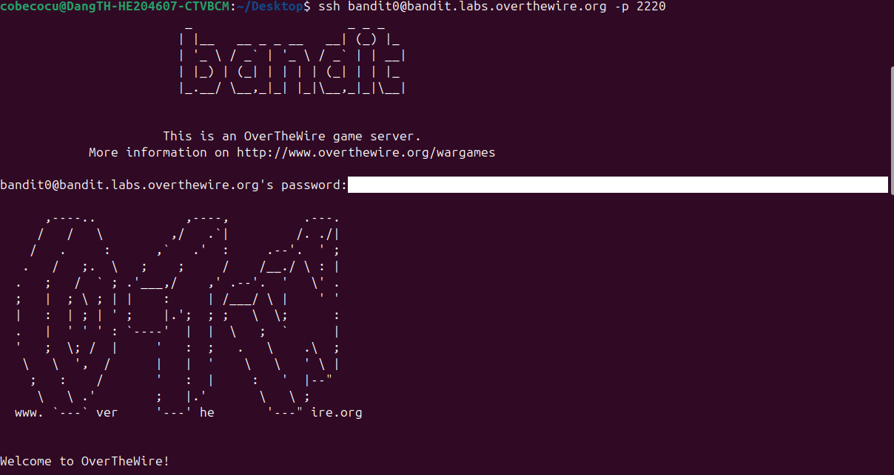
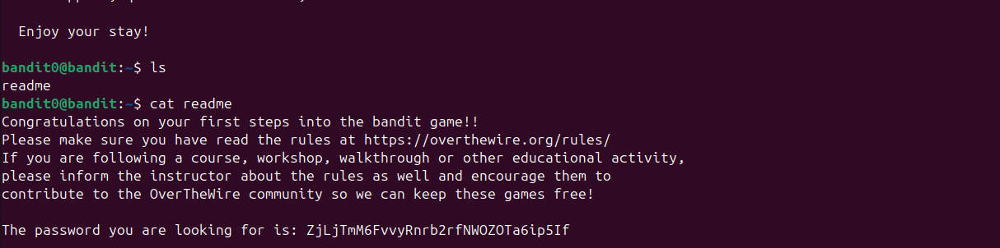

# BANDIT 0 CHALLENGE IN OVER THE WIRE 

### Rất đơn giản, login vào thôi.

```bash
ssh bandit0@bandit.labs.overthewire.org -p 2220
```



Sau đó, bằng **cat readme**, ta có thể đọc được nội dung trong file này.


