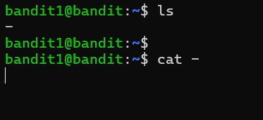
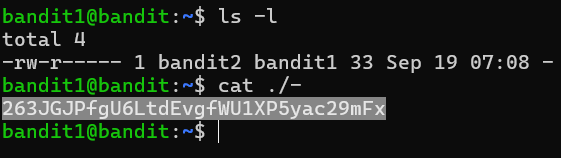

# BANDIT 1

### Nếu làm theo cách thông thường 

Dùng mật khẩu đã có ở bandit0 login vào bandit1

Với lệnh ls có thể nhìn thấy file có tên là **-**, dùng lệnh 
```bash
cat -
```

Kết quả sẽ bị như hình dưới :)))



### Phải bạn ko? Cùng sửa nhé :))



Và đây là kết quả :
```
263JGJPfgU6LtdEvgfWU1XP5yac29mFx
```

Link bandit 2 : [Bandit 2](../Bandit_2)