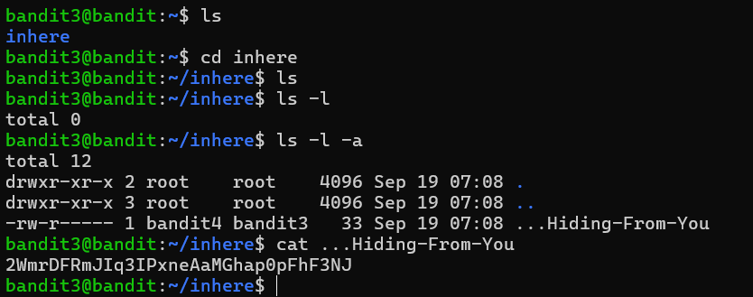

# BANDIT 3

Dùng lệnh :
```bash
ls -la
```

hoặc 
```bash
ls -l -a
```

Để liệt kê tất cả các file.

Sau khi liệt kê được file, ta ngay lập tức có kết quả



Kết quả :
```
2WmrDFRmJIq3IPxneAaMGhap0pFhF3NJ
```