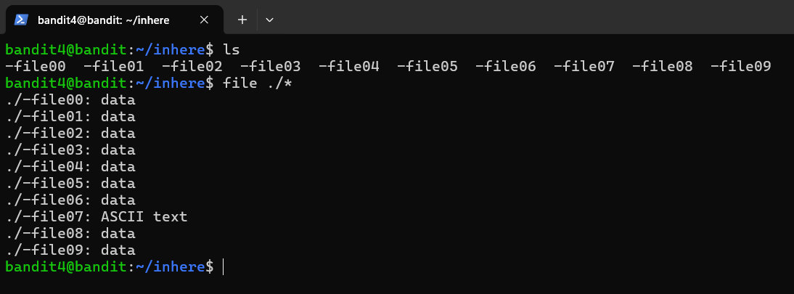

# BANDIT 4

Nếu ta thử các lệnh **cat ./-file00** cho đến **08**
Thì kết quả sẽ như hình dưới :


Kết quả cuối :
```
4oQYVPkxZOOEOO5pTW81FB8j8lxXGUQw
```
Nhưng chúng ta có một cách làm khác :

```
file ./*
```

Lệnh này sẽ liệt kê loại nội dung của các file có trong thư mục hiện tại. Kết quả :



Link bandit 5 : [Bandit 5](../Bandit_5)
